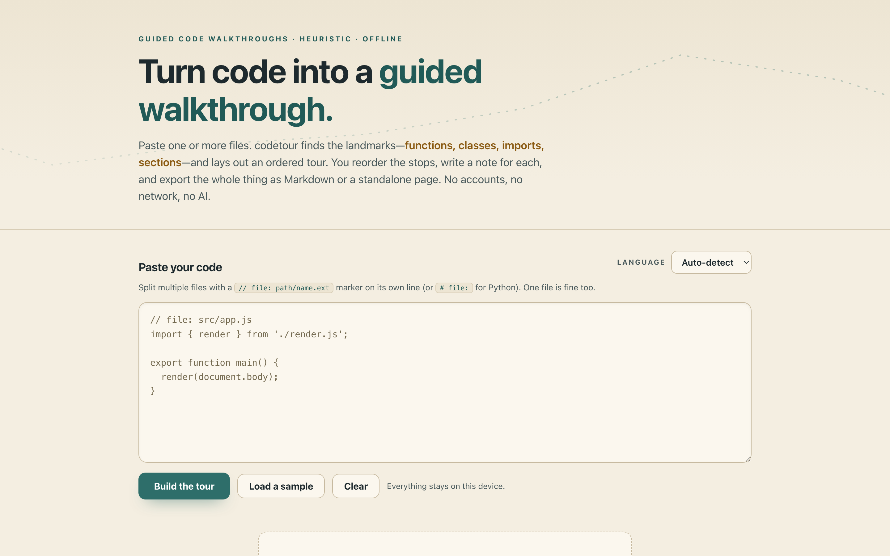

# codetour

**Turn code into a guided walkthrough.** Paste one or more files and codetour reads the *structure* — functions, classes, methods, imports, top-level sections — and scaffolds an ordered tour of "stops". You reorder them, write a note for each, and export the whole thing as Markdown or a standalone HTML document. 100% client-side, zero dependencies, works fully offline, **no AI**.

## Why

Onboarding someone to a codebase usually means either a wall of auto-generated API docs (structure without meaning) or a long Slack thread (meaning without structure). Neither travels well.

codetour splits the work the honest way: **the machine finds the landmarks, the human explains them.** It parses your pasted code with plain heuristics, proposes a reading order that puts entry points first, and gives you a clean place to write *why each piece matters*. The result is a numbered, annotated walkthrough you can hand to a new teammate — as Markdown for your repo, or as a single self-contained HTML page.

## Features

- **Heuristic structure parsing** — detects functions, classes, methods, imports/exports, types and sections for **JavaScript, TypeScript, Python and Go** using regular expressions and light tokenisation. Anything else is treated gracefully as plain text (split on headings and blank lines).
- **Multi-file input** — paste several files at once, separated by a `// file: path/name.ext` marker on its own line (`# file:` works too). Each file is detected and parsed independently.
- **Auto-proposed tour** — stops arrive in a sensible order: entry points (`main`, `run`, `__main__`, `App`, …) first, then declarations in file order. Each stop carries an anchor, a line range, and a real code excerpt pulled by brace- or indentation-matching.
- **Reorder & annotate** — move stops up/down, remove ones you don't need, and write a plain-language note for each. Everything autosaves.
- **Export** — download the walkthrough as **Markdown** (fenced code blocks per language) or as a **standalone HTML** document (self-contained, styled, offline-ready) via a `data:` URL. No server involved.
- **100% offline** — no accounts, no network calls, no tracking, no AI. Your code and notes never leave your device.

## Quickstart

Just open `index.html` in any modern browser — no build step, no server, no install.

- **Local:** double-click `index.html`, or run a static server in the folder.
- **Hosted:** **[Open codetour live](https://sreenivas-sadhu-prabhakara.github.io/codetour/)**

Press **Load a sample** to see a mixed JS/Python/Go walkthrough build instantly. Your tour is saved to your browser's local storage, so it persists between visits until you clear it.

## Privacy

codetour is built to be trustworthy with code you can't paste into a cloud tool.

- A strict Content-Security-Policy sets `connect-src 'none'`: the app **cannot** make any network request even if it tried. No fonts, scripts, images, or analytics are loaded from anywhere.
- All parsing runs in your browser. Your code and notes are saved only to your own device's local storage and are never transmitted.
- Exports are generated in-page as `data:` URLs and downloaded directly — nothing is uploaded to produce them.
- Because there are no network dependencies, codetour works with no connection at all.

## The honest limitation

**codetour is heuristic, not semantic.** It finds landmarks by pattern-matching source text — it does **not** run, compile, or truly *understand* your code, and it does **not** use AI or any language model. That has real consequences:

- It can miss declarations written in unusual styles, and it can occasionally mislabel one (e.g. a variable assigned a function vs. a plain value).
- Excerpt line-ranges are found by matching braces (JS/TS/Go) or indentation (Python); deeply unusual formatting can throw them off.
- Only JavaScript, TypeScript, Python and Go get language-aware parsing. Everything else degrades to plain-text sections — still useful for building a tour, just without typed landmarks.
- **The explanations are yours.** codetour scaffolds the tour; it cannot tell you *what the code means*. Treat the auto-detected structure as a starting point to edit, not as ground truth.

## Disclaimer

codetour is provided for general documentation and educational purposes only. Its structural analysis is heuristic and may be incomplete or incorrect; it is not a substitute for reading the source, for a code review, or for professional engineering judgement. This software is provided under the MIT License, "as is", without warranty of any kind; the authors accept no liability for any loss or damage arising from its use, including any inaccuracy in the generated walkthroughs.

## License

[MIT](./LICENSE) © 2026 Sreenivas Sadhu Prabhakara
